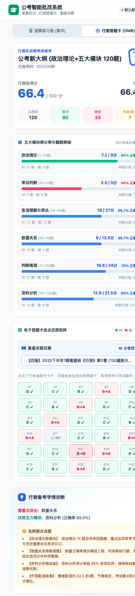
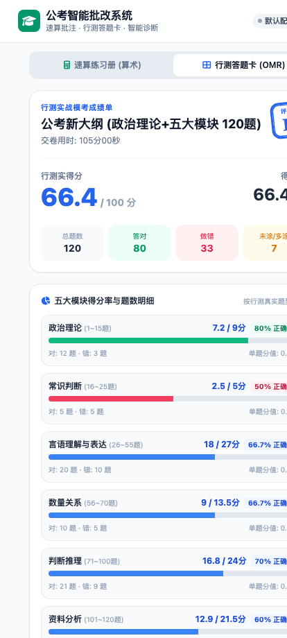
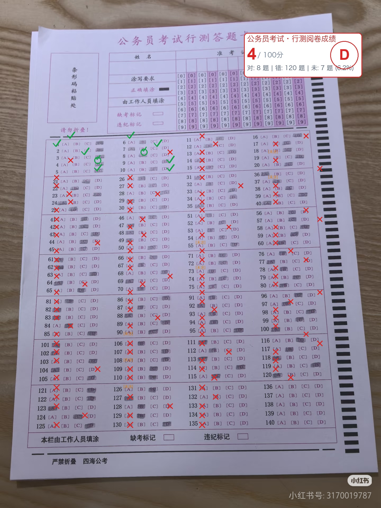
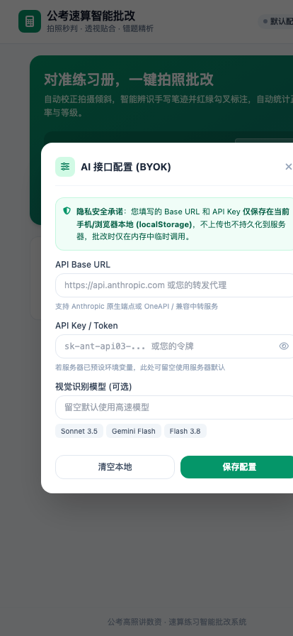
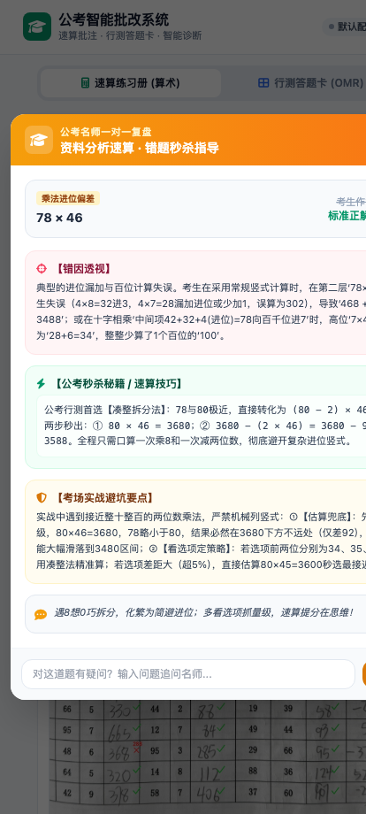
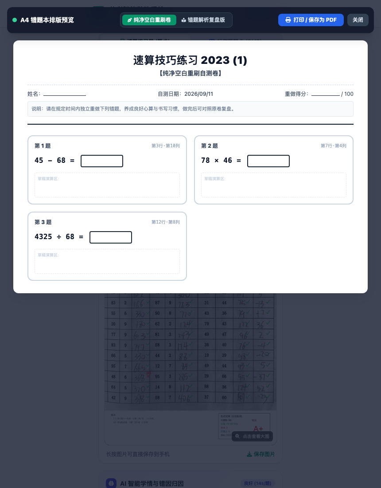
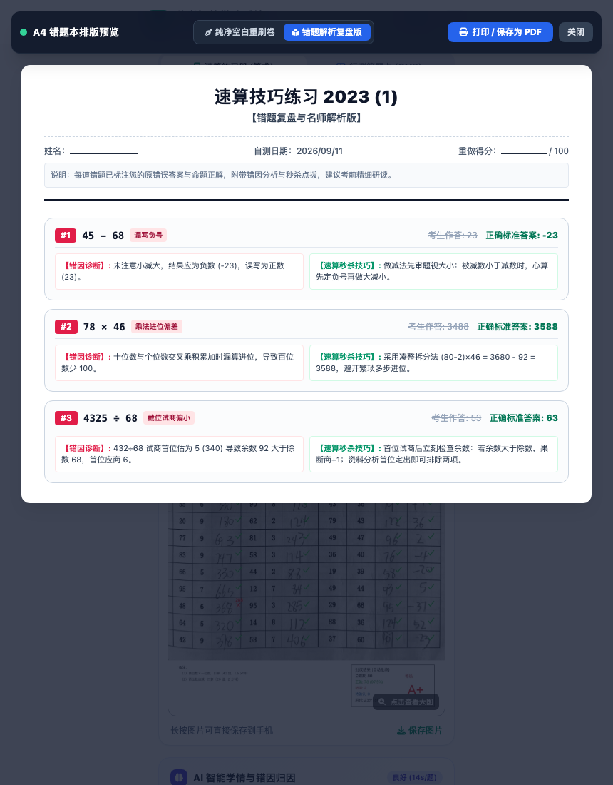

# 📐 公考行测智能批改系统 (Math Grader & OMR)

> 🌐 **在线即刻体验**：[https://math.jack261108.eu.cc/](https://math.jack261108.eu.cc/)  
> 💡 支持手机微信 / 移动浏览器 / 电脑桌面直接访问；支持 **BYOK (Bring Your Own Key)** 本地自带密钥模式，配置仅存本地浏览器，服务端零文件存储、无状态计算，绝对保障隐私安全。

面向公务员考试《行政职业能力测验》（行测）的**全流程智能备考、极速批改与深度学情诊断系统**。

系统深度融合**传统计算机视觉 (CV)** 与**多模态大语言模型 (LLM)**，提供全方位备考闭环支持：
1. **资料分析速算练习册**：手机拍照透视矫正、180°倒置自检与闭环纠偏、多模态笔迹提取、确定性数学校验、双层高保真红绿勾叉标注，配有**实战竞速计时与段位配速画像**及**薄弱项自适应 20 题同型强化练**；
2. **全真模考伴考计时与四象限 ROI 诊断**：专为纸笔模考量身打造伴考中控台，支持 **120 分钟倒计时**、**沉浸全屏数码大钟**、**桌面立放横竖屏台钟**、**高可用屏幕常亮防熄屏**、**模块路标与分段打卡 (Lap)**、**考场声效广播**以及考后**交互式四象限用时-得分散点图诊断**；
3. **客观选择题答题卡 (OMR & 在线交互)**：支持 **CV+LLM 混合识别高性价比引擎**与 **2B 铅笔高仿真在线交互填涂** 双模自由切换；全面适配公考新大纲六大模块自定义题号与单题分值（精确核算满分 100 分），支持**答案截图一键视觉 OCR 录入**与标准电子答题卡诊断大图生成；
4. **错题名师秒杀点拨与速算公式知识库**：一键调用大模型深度剖析错因与公考破局技巧，内置行测核心速算公式与模块口诀库，支持一键复制与引用追问；
5. **纯前端 A4 错题本与空白重做卷排版引擎**：纯前端矢量排版，支持一键打印或导出高质量 A4 纯净空白重做卷与错题复盘解析版；
6. **服务端 100% 内存级无状态计算与零文件存储**：纯内存完成图像解码、识别、核算与 Base64 Data URL 编码直出，服务端不保存任何试卷照片、批改标注大图或做题历史，彻底保障多用户与公网访问下的绝对隐私与零数据残留；
7. **现代化技术架构**：前端采用 **Vue 3 + Vite + Pinia + Vue Router + TailwindCSS** 现代化响应式工程体系，后端基于 **FastAPI** 异步微服务，配合 **BYOK (Bring Your Own Key)** 本地端安全防护机制。

---

## 📸 页面与批改效果预览

### 1. 行测客观题答题卡 (OMR) 与电子答题卡还原

| ⚙️ 答题卡配置与模块分值 | 📊 全卷分模块得分与学情诊断 | 🟢 电子答题卡还原色块矩阵 | 🏷️ 实体答题卡原图标注卡片 |
| :---: | :---: | :---: | :---: |
|  |  |  |  |

### 2. 速算练习册移动端界面（手机微信 / 浏览器直达）

| 📷 手机主页与 BYOK 本地设置 | 📊 智能学情诊断与错题归因复盘 |
| :---: | :---: |
|  |  |

### 3. 速算练习册批改标注与高保真对齐效果

| 📄 扫描展平版标注全图 (Standard Scan) | 📱 手机拍摄原图逆透视贴合 (Perspective Overlay) |
| :---: | :---: |
|  |  |

### 4. 核心算法细节特写

> 包括**表头与第 1 行精准切分绿勾**、**错题红叉与红色标准答案标注**，以及**右下角 A+ 评级统计印章卡片**：

<p align="center">
  
</p>

### 5. 提分利器：错题【💡 问名师】AI 秒杀解析与【🖨️ A4 错题重做卷】

| 💡 错题一对一名师点拨与秒杀破局 | 📝 A4 纯净空白重刷卷 (草稿与演算区) | 📖 A4 错题复盘版 (错因诊断与名师技巧) |
| :---: | :---: | :---: |
|  |  |  |

---

## ✨ 核心特性

### ⏱️ 全真模考伴考计时、全屏中控台与四象限用时-得分 ROI 诊断 (`OmrPaperTimer.vue` / `OmrTimingAnalysis.vue` / `omr_judge.py`)
- **专为纸笔模考量身打造伴考中控台**：
  - 支持 **120 分钟标准国考/省考全真倒计时**与正向秒表自由切换；
  - **沉浸式全屏数码大钟**：采用 `Teleport to body` + `100dvh` + 全屏防滚动穿透锁定，深度适配全面屏刘海、挖孔与底部手势条安全区（`env(safe-area-inset)`）；
  - **桌面立放台钟模式**：支持手机端横竖屏自由旋转与强制切换，横屏秒变桌面电子考场台钟（左右分栏布局）；
  - **电脑端专属宽屏双翼中控台 (`max-w-7xl`)**：左侧超大数码钟，右侧各模块全景路标卡与段位标尺；支持全局无感键盘快捷键（`Space` 一键打卡、`P` 暂停/继续、`Enter` 拍照批改、`Esc` 退出全屏）。
- **高可用屏幕常亮防熄屏 (`wakeLockHelper.js`)**：
  - 点击开始或继续做题时全自动激活常亮，监听 `visibilitychange` 与 `focus` 事件，前后台切屏无缝续期；
  - 内置循环静音微视频播放兜底（NoSleep Fallback），确保各类移动端主流浏览器 100% 绝对不灭屏；提供醒目的状态徽章随时掌控常亮状态。
- **模块路标与一键分段打卡 (Section Lap)**：
  - 完整呈现政治理论、常识、言语、数量、判断、资料各大模块建议作答时长与实时进度条；
  - 模块完成一键打卡（Lap），记录各模块真实耗时与单题平均用时；完美支持考生考场实战中的自由跳序做题。
- **考场真实声效与语音广播**：
  - 集成原生 Web Audio 考场钟声与 Web Speech 语音播报，提供开考铃声、最后 15 分钟涂卡预警广播、最后 5 分钟冲刺提醒与考试结束交卷钟声。
- **考后用时-得分四象限散点图诊断**：
  - 结合实际各模块用时与答题正误，生成交互式 SVG 用时-得分四象限散点图：
    - 🟢 **高效核心区（低用时·高得分）**：强势得分板块，用时短命中率高，维持手感；
    - 🔴 **高危陷阱区（高用时·低得分）**：耗费大量时间但错误连连，备考重点止损或攻坚；
    - 🟡 **可惜消耗区（高用时·高得分）**：虽得分但过度挤占时间，需强化做题技巧提速；
    - ⚪ **急躁盲区（低用时·低得分）**：因求快或轻敌导致粗心失分，需纠偏做题心态；
  - 散点图支持交互点击题号，秒级定位单题详情；
  - 计算各模块**单位时间得分产出 ROI 排行榜（分/分钟）**，精准指导临考策略取舍；
  - 为使用机械手表的考生提供手工快速补录抽屉，支持一键按大纲建议比例分配用时。

---

### ⚡️ 速算薄弱项自适应 20 题同型强化练 (`adaptive_math_generator.py` / `MathTargetedPracticeModal.vue`)
- **纯 Python 原生数学规则引擎**：
  - 针对速算批改诊断出的高频薄弱短板，由纯本地数学引擎**毫秒级即时动态生成 20 道高拟真度同型强化算式**（零 Token 消耗、零外部依赖）；
  - 深度覆盖四大高频痛点题型：
    - **三位数退位借位减法专项**：必含连续退位借位，训练高位直减心算手感与准确率；
    - **四位数除以三位数首两位截位直除专项**：模拟公考资料分析计算特征，训练首位/前两位试商与估大估小修正；
    - **多位数连续进位加法专项**：高密度连续进位，强化加法心算速度；
    - **两位数乘法拆分凑整专项**：覆盖尾数法、平方差、凑整法与十字相乘法。
- **即时刷题与 A4 空白卷一键导出**：
  - 诊断画像中点击薄弱项即可唤起强化练弹窗，支持在线心算竞速即答即判、即时校验、错因点拨与一键导出 A4 空白重做卷，达成「诊断薄弱 $\to$ 即刻强化 $\to$ 彻底攻克」的完整闭环。

---

### 🏁 速算实战竞速计时器 & 实时配速段位画像 (`math_judge.py` / `MathUpload.vue` / `MathResult.vue`)
- **实战竞速计时器**：
  - 支持正向秒表与 **1m~30m 限时极速冲刺挑战倒计时**，超大数码时钟视觉呈现；
  - 计划题量联动（10/20/30/50/100 题）与单题平均配速（秒/题）动态仪表盘；
  - 临界阶段暖橙与猩红极限冲刺警报，Web Audio 竞速发令与冲刺音效；
  - 计时完成自动将实际用时同步填入完成用时，一键联动调起后置相机拍照批改。
- **对标公考行测资料分析黄金标准的段位画像**：
  - 依据平均单题配速与正确率评定实时段位徽章：
    - 👑 **王者极速（< 3.5秒/题）**：心算大宗师级别，资料分析秒杀基石；
    - 💎 **进阶钻石（3.5 ~ 6.0秒/题）**：优秀稳定，胜任省考国考常规计算；
    - 🥇 **黄金标准（6.0 ~ 9.0秒/题）**：标准及格线，建议针对薄弱项持续提速；
    - 🥉 **青铜蓄力（> 9.0秒/题）**：亟需掌握截位直除与凑整估算技巧。

---

### 🔍 CV 传统算法与多模态 LLM 混合识别引擎 (`omr_cv_scanner.py` & `omr_engine.py`)
- **传统 CV 物理点阵高精度高速扫描**：
  - 基于物理点阵几何投影、局部背景白平衡自适应校准与多尺度石墨填充积分测量；
  - 0 毫秒级纯本地识别，精准辨识 2B 铅笔填涂、黑色水笔填涂；
- **三级置信度裁决与靶向送审**：
  - **高置信度题目**：纯本地 CV 算法毫秒级直接裁决通过；
  - **争议/涂改/轻微填涂题目**：自动裁剪微型条带切片（Strip Patch）并拼接为微图，靶向送审多模态大模型进行高保真辨识；
  - 识别速度大幅提升 **300%**，同时节约 **80%+** 的多模态 API Token 消耗；
  - 全卷保留最终物理石墨积分校准双保险，彻底杜绝漏判误判；
  - 支持根据录入的标准答案题数自动自适应生成对应题数的答题卡。

---

### ✏️ 在线交互答题卡与 2B 铅笔高仿真填涂 (`OmrOnlineSheet.vue`)
- **双模自由切换**：支持「📸 拍照扫描答题卡」与「✏️ 在线极速涂卡纸」无缝切换，兼顾纸笔模考拍照批改与电脑/手机在线纯电子刷题；
- **2B 铅笔高仿真交互**：依据试卷规则自动生成模块答题矩阵，实心深蓝填涂视觉，支持单击填涂、重复点击反选取消、同题互斥单选；
- **实用提效工具**：作答进度实时看板、🎯 定位首个未答、⚡️ 模拟随机填涂、🧹 一键清空重做；
- **秒级极速判分**：在线作答免图像解码流水线，<0.05 秒完成全卷核算，自动生成标准高清电子答题卡诊断大图（`/output/*_card.jpg`）。

---

### 📝 行测选择题 OMR 与分模块精准判分 (`omr_judge.py`)
- **主流大纲模板即选即用**：内置新大纲 120 题（含政治理论 15 题）、新大纲 130 题（政治理论 20 题）、经典国考 135 题（副省级满分 100 分）、经典省考 120 题（通用满分 100 分）、专项突击 20 题与微模考 30 题；
- **模块分值自由可配**：支持自定义六大模块（政治理论、常识、言语、数量、判断、资料）的题号范围与单题分值，严格核算全卷总分 100.0 分；
- **📷 答案长图一键视觉 OCR 识别**：支持直接上传培训机构发布的答案长图或截屏，多模态大模型自动提取题号与答案字母并回填；
- **复杂真题版式容错与附加题防覆盖**：精准兼容双短横线多列排版（`1--5 CBADC`）、波浪线冒号排版（`1 ~ 5: CBADC`），卷末附加题自动顺延，保护正题不被覆盖。

---

### 💡 错题一键【问名师】AI 智能解析与公考速算公式口诀库 (`ai_tutor.py` & `frontend/src/constants/formulas.js`)
- **行测全模块名师点拨**：针对计算失误剖析错因，针对客观题剖析偷换概念、绝对表述等选项设错陷阱，提供代入排除、矛盾项研判等破局解法；
- **内置公考核心速算公式与模块口诀库**：
  - 汇聚公考高频核心公式：十字相乘法、两期比重升降判定、平均数增长率、隔年增长率、特征数字法（$\frac{1}{6}\approx16.7\%, \frac{1}{7}\approx14.3\%$ 等）、截位直除法；
  - 在【问名师】弹窗中集成快捷标签栏与沉浸式抽屉面板，提供口诀要点、推导过程与典型真题例题；
  - 支持**一键复制口诀**与**一键引用公式至追问输入框**。

---

### 📐 稳健自适应的计算机视觉与大模型朝向自检闭环 (`cv_detector.py` / `vision_ocr.py`)
- **稳健几何定位**：四角点自适应扩展、自相关物理行距测定（Autocorrelation，96~104px）、自底向上逆向锚定与波峰吸附；
- **竖线过滤与倒置纠偏**：精准过滤表格竖线干扰，防止表格线被误判为书写笔迹；
- **大模型朝向自检闭环**：多模态识别流水线内置图片朝向自检机制，若发现倒拍、反拍（180°倒置）自动触发闭环图像旋转矫正与重识别。

---

### 🖨️ 纯前端高性能 A4 错题本与纯净空白重刷卷排版引擎 (`@media print` / `PrintModal.vue`)
- **双视图自由切换**：
  - **📝 纯净空白重刷卷**：自动隐藏原书写错误与正确答案，排版为规整题号、标准算式、答题方框或 ABCD 选项圈，保留姓名、日期与自测得分栏，一键打印供考前二次重刷；
  - **📖 错题解析复盘版**：完整呈现错误作答、标准正解、失分错因诊断与名师秒杀解题要诀；
- **原生矢量排版**：基于纯前端 CSS `@media print` 与 `@page { size: A4 portrait; margin: 15mm 12mm; }`，直接导出高清矢量 PDF 或无线隔空打印，自带防跨页断题（`break-inside: avoid`）保护。

---

### 💻 现代化 Vue 3 渐进式前端工程体系 (`frontend/`)
- 基于 **Vue 3 + Vite 5 + Pinia + Vue Router 4 + TailwindCSS** 模块化开发；
- 状态按领域分层解耦（`math`, `omr`, `modal`, `config`, `tutor`）；
- 移动端、平板与桌面超宽屏全响应式自适应布局；
- 编译产物自动注入 `static/dist/`，由 FastAPI 高性能静态托管。

---

### 📱 移动端极简体验与自带密钥安全架构 (BYOK)
- **Bring Your Own Key (BYOK)**：支持在页面右上角【⚙️ 设置】配置个人 Base URL 与 API Key，数据**仅保存在浏览器本地 (`localStorage`)**，绝不在服务端持久化存储或记入日志；
- 服务端启动后终端自动打印局域网访问二维码，手机扫码秒级直达；
- 支持调用后置原生高清相机拍摄。

---

## 📂 项目结构

```text
math-correct/
├── cv_detector.py            # 计算机视觉：角点检测、透视矫正、行距自相关、竖线过滤与倒置纠偏
├── vision_ocr.py             # 多模态视觉模型提取速算题面与手写笔迹（含朝向自检闭环）
├── math_judge.py             # 严格数学核算、深度错因归因与学情诊断、做题配速画像
├── adaptive_math_generator.py# 速算薄弱项自适应 20 题同型强化练数学规则引擎
├── renderer.py               # 双层标注渲染（展平图/手机原图、勾叉与统计卡片）
├── omr_cv_scanner.py         # 答题卡物理点阵投影、自适应白平衡与多尺度石墨填充积分测量
├── omr_engine.py             # 行测答题卡混合识别引擎（传统 CV 扫描 + 多模态 LLM 靶向切片复核）
├── omr_judge.py              # 行测分模块判分、自定义题号分值、全真模考配速与四象限用时-得分诊断
├── omr_renderer.py           # 电子答题卡报告与全卷点位矩阵渲染
├── omr_annotator.py          # 实体答题卡原图标注与勾叉复核
├── ai_tutor.py               # 错题一键【问名师】智能解析与公考秒杀技巧辅导
├── main.py                   # 批改流水线核心及 CLI 命令行入口
├── server.py                 # FastAPI 移动端与全功能 Web 服务（纯内存无状态批改引擎）
├── deploy.sh                 # 一键拉取最新代码、字体检测、依赖同步、前端编译与服务平滑重启脚本
├── frontend/                 # 现代化 Vue 3 + Pinia + Vue Router + Vite 前端工程
│   ├── src/
│   │   ├── api/              # API 异步请求层（速算、答题卡、名师接口）
│   │   ├── components/       # 业务组件库（速算、答题卡、伴考计时器、四象限诊断、通用模态框等）
│   │   ├── constants/        # 公考考场时序、速算核心公式库口诀、常规模板常量
│   │   ├── stores/           # Pinia 响应式状态管理（速算、答题卡、弹窗、全局配置等）
│   │   ├── utils/            # 工具库（常亮防熄屏、全屏台钟、图片压缩、格式化等）
│   │   └── views/            # 核心业务视图（MathView 速算、OmrView 答题卡）
│   ├── package.json          # 前端依赖配置
│   └── vite.config.js        # Vite 构建与代理配置
├── static/
│   └── dist/                 # 前端工程 Vite 生产构建产物（被 FastAPI 自动托管）
├── output/                   # 批改结果输出目录（仅供 CLI 命令行模式，Web 服务零文件存储）
├── requirements.txt          # Python 依赖清单
└── README.md                 # 项目完整使用说明与技术架构文档
```

---

## 🚀 快速上手

### 0. 在线即刻体验（免本地部署）

系统已部署在公网环境，无需在本地配置环境即可直接体验全功能：

🔗 **在线体验地址**：[https://math.jack261108.eu.cc/](https://math.jack261108.eu.cc/)

- 📱 **多端全自适应**：手机浏览器、微信或电脑桌面直接访问，支持调起手机后置相机拍摄，也支持大屏全屏台钟与在线涂卡；
- 🔑 **自带密钥 (BYOK)**：初次进入点击右上角 **【⚙️ 设置】**，填入个人兼容大模型 API Key（如 Claude 3.5 Sonnet 等），配置数据**仅保存在您本地浏览器 `localStorage` 中**，绝不在服务端持久化存储或记入日志。

---

### 1. 本地环境准备

推荐使用 **Python 3.10+** 与 **Node.js 18+**：

```bash
# 1. 安装 Python 后端依赖
pip install -r requirements.txt

# 2. 编译前端工程（若需修改或二次开发前端代码）
cd frontend
npm install
npm run build
cd ..
```

> **提示**：仓库内 `static/dist` 已内置最新编译好的前端静态产物，初次运行若不改动前端代码，可跳过 `npm run build` 直接启动后端。

---

### 2. 配置 API Key（两种方式）

系统支持兼容 Anthropic 协议的多模态视觉 API（如 Claude 3.5 Sonnet、Gemini Flash 等）：

- **方式 A：手机/前端自带 Key (BYOK，强烈推荐)**：
  - 服务端无需配置任何 Key，直接启动；
  - 在页面右上角点击 **【⚙️ 设置】**，填入个人 API Key 与中转地址；
  - **安全保障**：所有配置仅保存在客户端本地 `localStorage`，请求批改时随请求在内存中临时使用，绝不写入服务器磁盘或日志。

- **方式 B：服务端全局配置（适合个人独享）**：
  - 复制项目根目录模板：`cp .env.example .env`
  - 在 `.env` 中填入你的 `ANTHROPIC_BASE_URL` 与 `ANTHROPIC_AUTH_TOKEN`；
  - 或直接设置系统环境变量：
    ```bash
    export ANTHROPIC_BASE_URL="https://api.anthropic.com"
    export ANTHROPIC_AUTH_TOKEN="your-api-key"
    ```

---

### 3. 启动全功能 Web 服务

```bash
python server.py
```

控制台将打印局域网访问链接与 ASCII 二维码：
- 确保手机与电脑处于**同一 Wi-Fi / 局域网**；
- 手机浏览器或微信扫码直达，享受顺畅的备考批改体验！

---

### 4. 生产环境一键部署与平滑更新

若将系统部署在 Linux 云服务器（如 Ubuntu / Debian），项目内置了全自动部署脚本：

```bash
# 赋予执行权限并运行
chmod +x deploy.sh
./deploy.sh
```

脚本将自动执行：
1. `git pull` 拉取最新代码；
2. 自动检测并安装中文字体（`fonts-wqy-microhei`）；
3. 检查并同步 Python 虚拟环境与依赖；
4. 编译打包最新的 Vue 3 前端工程；
5. 重启 Supervisor 守护进程并完成 HTTP 健康检查。

---

### 5. 命令行独立批改单张试卷 (CLI)

```bash
python main.py /path/to/sheet_photo.jpg --time-str "23分18秒"
```

批改完成后将在 `./output` 目录下生成：
- `*_annotated_scan.jpg`：扫描展平批改图；
- `*_annotated_original.jpg`：手机原图视角贴合标注图；
- `*_report.json`：详细答题明细与统计指标。

---

## 🎯 备考实战全流程指南

### 场景一：日常资料分析速算训练与弱项攻克
1. 访问首页 **【📐 速算练习】**；
2. 在 **【实战竞速计时器】** 中设定目标挑战时间（如 10 分钟）或开启正向秒表，点击开始并自动锁定屏幕防熄屏；
3. 做题完毕停表，用时自动同步；点击 **【拍照批改】** 上传速算练习册照片；
4. 系统瞬间完成角点校正、反拍自检、笔迹识别与数学核算，呈现段位徽章（王者/钻石/黄金/青铜）与做题均速（秒/题）；
5. 诊断画像直击失分薄弱点（如三位数退位借位减法），点击即可唤起 **【⚡ 针对性同型强化练】**，在线竞速刷 20 道或一键导出 A4 卷彻底攻破！

### 场景二：纸笔全真模考伴考计时与拍照极速批改
1. 切换至 **【田 行测答题卡】** 模式；
2. 展开 **【⏱️ 纸质做题全真模考计时】**，设定 120 分钟倒计时，轻触 **【⛶ 全屏】** 进入沉浸式考场台钟（手机横放秒变专业计时器）；
3. 按照建议顺序答题，每完成一个模块轻触一次 **【模块打卡 (Lap)】**（电脑端支持键盘 `Space` 无感打卡）；
4. 考场广播自动在最后 15 分钟与 5 分钟响起警报与钟声；
5. 考试结束拍照上传答题卡，**传统 CV + 多模态 LLM 混合引擎**瞬间完成识别，生成分模块得分与**四象限用时-得分 ROI 诊断图**！

### 场景三：无纸化纯电脑/平板在线交互刷题
1. 在答题卡页面切换至 **【✏️ 极速在线涂卡纸】** 模式；
2. 启动考场 120 分钟严格控时倒计时，实时查看全卷与各模块作答进度条；
3. 直接点击对应题号的 ABCD 气泡进行填涂，支持反选取消、随机填涂测试与一键定位未作答题目；
4. 点击交卷批改，0.05 秒瞬间完成判分，零 Token 消耗并生成标准电子答题卡诊断大图。

### 场景四：错题一键【问名师】与速算公式速查
1. 在批改结果页或错题列表中点击 **【💡 问名师】**；
2. 多模态大模型深度拆解错题错因，输出针对性公考秒杀解法；
3. 展开顶部公式抽屉，随时查阅十字相乘、两期比重、平均数增长率、特征数字等速算口诀，支持一键复制与引用追问。

---

## 📄 License

MIT License
