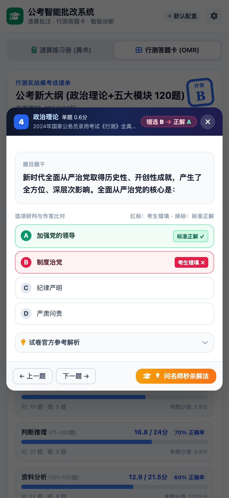
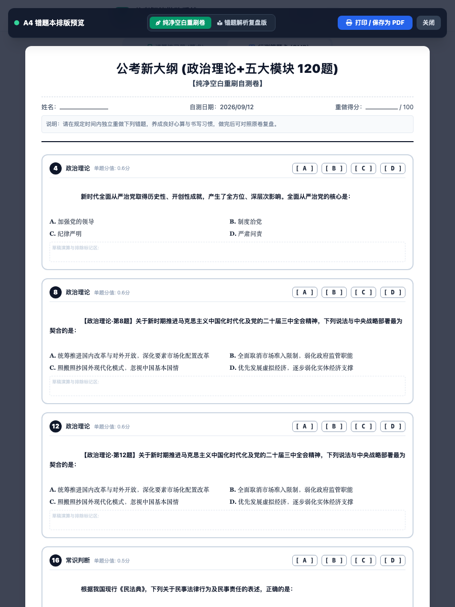
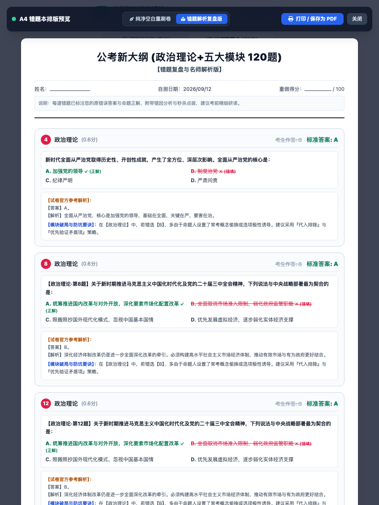

# 📐 公考行测智能批改系统 (Math Grader & OMR)

面向公务员考试《行政职业能力测验》（行测）的**全自动智能批改与学情诊断系统**。
同时支持：
1. **资料分析速算练习册**：手机拍照透视矫正、多模态笔迹识别、确定性数学校验与原图红绿勾叉标注；
2. **客观选择题答题卡 (OMR & 在线交互)**：支持**拍照扫描实体答题卡**与**在线交互答题卡点选填涂**双模式自由切换，**全面适配公考新大纲（政治理论、常识、言语、数量、判断、资料六大模块）自定义题号范围与单题分值**，精确核算满分 100 分，支持**答案截图一键视觉 OCR 录入**、全卷预览边看原题边答题，生成专业电子答题卡与学情画像；
3. **试题 PDF 智能解析入库**：直接上传真题/模考 PDF 试卷，大模型结合分块算法全自动提取材料、题干、选项、答案与官方解析，一键生成标准题库并联动答题卡复盘。

---

## 📸 页面与批改效果预览

### 1. 行测选择题答题卡 (OMR)、真题反向呈现与 PDF 智能入库

| 📄 试题 PDF 智能解析入库 | 📚 关联套卷与一键带入答案 | 📖 原题浮窗沉浸式复盘 (题干+选项+正误) | 🟢 电子答题卡还原色块矩阵 |
| :---: | :---: | :---: | :---: |
|  |  |  |  |

### 2. 速算练习册移动端 H5 界面（手机微信 / 浏览器直达）

| 📷 手机主页与 BYOK 本地设置 | 📊 智能学情诊断与错题归因复盘 |
| :---: | :---: |
|  |  |

### 3. 速算练习册批改标注与高保真对齐效果

| 📄 扫描展平版标注全图 (Standard Scan) | 📱 手机拍摄原图逆透视贴合 (Perspective Overlay) |
| :---: | :---: |
|  |  |

### 4. 核心算法细节特写

> 包括**表头与第 1 行精准切分绿勾**、**错题红叉与红色标准答案标注**，以及**右下角 A+ 评级统计印章卡片**：

<p align="center">
  
</p>

### 5. 提分利器：错题【💡 问名师】AI 秒杀解析与【🖨️ A4 原题错题本 / 空白重刷卷】

| 💡 错题一对一名师点拨与秒杀破局 | 📝 A4 纯净空白重刷卷 (完整印制原题干) | 📖 A4 错题复盘版 (题干+选项+官方解析) |
| :---: | :---: | :---: |
|  |  |  |

---

## ✨ 核心特性

- ✏️ **在线交互答题卡与在线选择答案 (Interactive Answer Sheet & Online Grading)**：
  - **双模自由切换 (Dual-Mode Grading)**：彻底打破必须拍照上传纸质答题卡的限制，支持 **「📸 拍照扫描答题卡」** 与 **「✏️ 在线选择答案」** 两种模式一键平滑切换，既满足纸笔模考拍照批改，又支持纯电脑/手机在线刷题；
  - **2B 铅笔高仿真填涂交互**：依据当前试卷规格（120题、130题、135题或自定义分模块）自动生成五大/六大模块答题矩阵；ABCD 选项气泡采用 2B 铅笔实心深蓝填涂视觉，支持单击填涂、重复点击反选取消、同题互斥单选；
  - **三端作答双向联动引擎**：
    - **答题卡矩阵 ⇄ 原题弹窗**：点击题号 Badge 即可秒级唤起题干浮窗（`#questionModal`），浮窗内直接点选 ABCD 选项，关闭后答题卡即时同步更新；
    - **全卷全景全览边看边答**：在试卷预览模态框（`#paperPreviewModal`）中直接边读题干与图表边点击选项作答，顶部提供「交卷批改」快捷入口；
  - **高效备考实用工具箱**：
    - **作答进度实时看板**：顶部实时计算已答题数、未填题数与百分比进度条；
    - **🎯 定位首个未答**：一键精准平滑滚动聚焦到首道漏涂/未答题目；
    - **⚡️ 模拟随机填涂**：支持一键快速填充随机合法选项（便于快速演练与功能自测）；
    - **🧹 一键清空重做**：支持安全确认后瞬间重置全卷填涂；
  - **秒级极速判分与零 Token 消耗**：在线作答免图像解码与多模态识别流水线，<0.05 秒完成全卷分模块精准核算（满分 100 分制），并自动绘制标准高清电子答题卡诊断大图（`/output/*_card.jpg`），同步生成五大模块正确率雷达与名师学情画像。

- 📝 **行测选择题填涂卡 (OMR) 与分模块计分 (`omr_judge.py` / `omr_engine.py`)**：
  - **新大纲与主流考试模板即选即用**：内置新大纲 120 题（包含政治理论 15 题）、新大纲 130 题（政治理论 20 题）、经典国考 135 题（副省级满分 100 分）、经典省考 120 题（多省通用满分 100 分）、专项突击 20 题与微模考 30 题；
  - **分模块分值完全自由可配**：支持自定义政治理论、常识判断、言语理解、数量关系、判断推理、资料分析六大模块的起止题号与每题分值（精确核算全卷总分 100.0 分）；
  - **📷 答案长图一键视觉 OCR 识别**：支持直接上传机构（四海公考、粉笔等）发布的答案长图或截屏，多模态大模型自动提取题号与答案字母并回填，彻底摆脱手动输入的繁琐；
  - **复杂真题版式容错与附加题防覆盖**：精准兼容双短横线多列排版（`1--5 CBADC  6--10 DBACA`）、波浪线冒号排版（`1 ~ 5: CBADC`），并内置智能上下文感知，卷末附加题自动顺延，绝对保护试卷正题 1~5 题不被覆盖；
  - **多模态填涂识别**：智能辨识标准 2B 填涂块、手写 ABCD 字母，精准区分正常作答、未填留白与多涂；
  - **电子答题卡与学情突破锦囊**：生成全卷对错色块矩阵，直击得分率最低的薄弱板块并给出公考备考针对性建议。

- 📖 **真题题库关联与原题干反向呈现 (`paper_bank.py` + `data/papers/`)**：
  - **破解答题卡无试卷复盘痛点**：传统答题卡批改仅有选项 ABCD，复盘时考生需翻箱倒柜找试卷纸对照。系统支持真题套卷结构化关联，彻底实现“免带试卷”的原生沉浸式复盘；
  - **内置示范卷与自定义 JSON 导入**：内置《2024年国家公务员录用考试《行测》全真示范卷 (新大纲120题)》，完整涵盖政治理论、常识、言语、数量、判断、资料分析六大模块真题题干、背景材料、ABCD 选项与官方名师解析，并支持考生直接导入自建题库 JSON；
  - **沉浸式原题复盘浮窗 (`#questionModal`)**：点击答题卡矩阵中的任意题号色块，浮窗秒级弹出完整题干、折叠阅读材料、四个选项对比（红标考生错选 ✗、绿标参考正解 ✓）与官方参考解析，支持【◀ 上一题】/【下一题 ▶】快捷连续切题；
  - **名师 AI 题干深度感知联动**：浮窗内一键直达【💡 问名师】，大模型自动注入具体文段与选项，点拨由宏观模块技巧跃迁为针对具体题目的字句级秒杀破解；
  - **A4 错题本真题级排版印刷**：无论纯净空白重刷卷还是错题复盘版，均自动读取题干与选项排版入卷，自带防跨页保护，一键打印即是一份独立的高清纸质练习试卷。

- 📄 **试题 PDF 智能解析生成题库 (`pdf_parser.py` using `pypdf` & `Pillow`)**：
  - **直接上传真实试卷 PDF**：支持直接上传公务员国考、省考或机构模考的原始 PDF 试卷文件，无需手动费时费力整理复杂的标准 JSON 格式；
  - **纯 Python 轻量解析与零复杂 C 依赖**：基于 `pypdf>=6.0.0` 原生遍历与 `Pillow` 尺寸检测，实现高保真纯文本提取、页码拓扑结构重建与**内嵌图像自动提取（自动过滤 <30px 微标杂质）**，无需安装配置庞大繁琐的系统底层工具（如 poppler 或 tesseract）；
  - **🖼️ 图推与资料分析图片拓扑智能关联 (Topology Image Mapping)**：
    - **判断推理·图形推理（71~80题）**：自动探测题号所在物理页码，将该页图推特征图及 ABCD 选项配图精准绑定至题目的 `stem_images` 与 `options_images`；
    - **资料分析统计图表（101~120题）**：自动将统计柱状图、饼图、折线图等综合图表提取并注入到该组共享题目的公共 `material_images`，看题与复盘时材料区自适应联动呈现；
    - **全屏轻量看图灯箱与双指缩放**：手机端与电脑端轻触任何试题配图即可秒级唤起全屏高清灯箱，看清图推微小细节；
  - **🛠️ 单题与关联题群协同重新解析 (Cooperative Reparse)**：
    - 在原题复盘浮窗（`#questionModal`）及全卷预览（`#paperPreviewModal`）中直观提供【⚡ 自动重析】入口；
    - 针对公考 PDF 复杂排版引起的偶发配图错位或文字截断，智能推断同物理页图形推理题群或同材料资料分析 5 题题群，以题群为协同单元重新计算几何投影；
    - 支持「⚡ 智能几何快速重排」与「🤖 AI 大模型深度视觉纠偏」双引擎，单题增量安全覆写，全卷其余 100+ 道题目绝对不受干扰；
  - **🤖 试卷解析后大模型审查与自动纠偏 (LLM Quality Review & Auto-Correction)**：
    - **轻量规则初筛 (Zero-Token Fast Inspection)**：试卷完成初次抽取与拓扑对齐后，自动快速扫描全卷题干完整度、标点悬空截断、选项数量与占位符退化状态，若全卷规范无缺陷则 0 Token 秒级放行；
    - **原文字符流靶向纠偏 (Targeted Auto-Correction)**：若命中题干残缺或选项混淆题目，自动提取对应物理页真实原文字符流，启动大模型“质检审查官”进行结构化高保真二次纠正并安全回填，保留已绑定配图，实现免人工介入的解析自愈；
  - **✍️ 试题精细手动纠错与自主添加/上传配图 (Manual Editing & Custom Image Upload)**：
    - **自主添加/上传试题配图**：无论在原题复盘浮窗还是全卷预览，用户唤起纠错时均可自主添加配图；支持自由指定归属槽位（**题干配图、选项 A/B/C/D、材料大图**），支持本地文件选择、拖拽上传以及弹窗内直接 `Ctrl/Cmd+V` 粘贴截图；
    - **双模式操作流**：既支持「📷 仅保存上传配图 (秒级直接生效)」，也支持「🚀 重新解析并应用配图 (自动合并覆盖)」；
    - **物理页面候选图片池智能索引**：自动扫描本卷全部切图并按当前题所在物理页自动置顶高亮推荐，提供 `[+设为题干图]`、`[设为选项A/B/C/D图]` 一键认领；
    - **全端热更新与审计跟踪**：就地更新内存与题库，答题卡复盘与全卷预览即时呈现修改结果，并在后台记录修改历史审计日志；
  - **公考长卷自适应分块抽取 (Chunking Strategy)**：公考行测试卷通常多达 100~135 题、2.5~4.5 万字长文，针对一次性输入大模型极易超出 Output Token 限制导致截断的难题，系统采用按公考六大模块或每 15~20 题自然切块的智能 Chunking 机制，保障单次抽取输出高度稳定；
  - **试题与答案解析版式智能对齐**：自动识别并抽离卷末【参考答案及解析】附录，提取全卷快速答案表并精准映射回各题，自动生成题干、ABCD 选项、参考正解与解析一体化的标准真题结构；
  - **双轨容灾设计 (Graceful Fallback)**：解析服务完整继承移动端前端 BYOK 密钥；当网络波动或未配置 Key 时，自动无缝降级为本地启发式规则引擎，保证基础题干与选项稳定入库；
  - **零摩擦一键套卷联动**：解析入库后，移动端套卷下拉列表自动刷新并选中新套卷，自动将识别出的标准答案一键填入答题卡输入框，批改后点击矩阵直接呈现真实原题。

- 📱 **移动端极简体验与自带密钥 (BYOK)**：
  - **Bring Your Own Key (BYOK) 安全架构**：支持在手机端右上角【⚙️ 设置】配置个人 Base URL 与 API Key，数据**仅保存在手机本地浏览器 (`localStorage`)**，绝不在服务端持久化存储或记入日志，用完即弃；适合将服务部署在公网或局域网共享给多人使用，互不干扰；
  - 服务端启动后在终端自动生成局域网访问二维码；
  - 手机微信或自带浏览器扫码直达，直接调起原生后置高清摄像头拍照或相册选取；
  - 移动端支持无缝切换查看“标准展平图”与“拍照原图标注图”，并提供详细错题分析清单。

- 🔍 **稳健自适应的计算机视觉引擎 (`cv_detector.py`)**：
  - **对称平衡外扩**：四角点自适应扩展，确保表头与最底部题目全部完整容纳在正视画幅中；
  - **自相关物理行距测定 (Autocorrelation)**：提取中右侧无笔迹干扰区域的水平投影，通过一维自相关精准测量当前视角下的真实物理行距（96~104px），自适应适应不同拍摄距离；
  - **自底向上逆向锚定与波峰吸附**：以底部无干扰线为基准逆推 21 个物理行，并在 $\pm 12\text{px}$ 窗口内微调吸附，彻底解决顶部标题下划线干扰及第 1 行偶发漏批问题。

- 🤖 **多模态大模型视觉提取 (`vision_ocr.py`)**：
  - 一次性结构化提取整卷 20 行（60~80 道题）的题面数值（A, B）及学生手写笔迹；
  - 智能处理涂改痕迹、识别负号（如 `-365`）与未作答留白；
  - 自动识别多种题型：两位数乘法、三位数加减、多位数除以两位数（商首位）、多位数除以三位数（商前两位）。

- 🧮 **确定性数学判题与智能错因归因 (`math_judge.py`)**：
  - **杜绝大模型计算幻觉**：视觉模型仅负责笔迹提取，由 Python 本地执行严谨的确定性算术校验；
  - **深度学情画像与错因诊断**：自动识别并分类**漏写负号、减数颠倒、加法进位遗漏、减法退位借位失误、乘法尾数算错、乘法进位相加偏差、除法截位估大估小、数字位置颠倒**等多种典型考公计算失误；
  - **量身定制提分锦囊**：分析全卷做题节奏（如秒/题）、判定核心薄弱项，并给出针对行测资料分析计算特性的避坑点拨。

- 🎨 **双层高保真标注与图层渲染 (`renderer.py`)**：
  - **展平规范图**：在手写数字右侧精准绘制半透明绿色对勾 `✓`、红色叉号 `✗` 及红色标准订正答案；
  - **原始倾斜图**：通过逆透视单应性变换矩阵 $M^{-1}$ 将标注向量投射回原始倾斜手机照片；
  - **成绩统计卡片**：在表格空白区域生成包含等级印章、得分率、题数统计的专业批改卡片。

- 💡 **错题一键【问名师】AI 智能解析与秒杀技巧 (`ai_tutor.py`)**：
  - **速算名师点拨**：针对计算失误深度剖析错因，输出凑整拆分法、十字相乘法、截位直除保留三位、特征数字等公考秒杀思维与心算步骤；
  - **行测全模块答疑**：针对做错的客观题，剖析偷换概念、绝对表述等选项设错陷阱，提供代入排除、矛盾项研判等破局解法，支持针对疑点追问互动；
  - **离线与兜底高可用**：内置行测资深教研规则库，未配置 Key 或大模型调用异常时依然能稳定输出针对性点拨。

- 🖨️ **纯前端高性能 A4 错题本与空白重刷卷排版引擎 (`@media print`)**：
  - **双视图自由切换**：
    - **📝 纯净空白重刷卷**：自动隐藏原书写错误与正确答案，排版为规整题干、标准答题方框或 2B 选项圈，自适应印制图形推理题干图、资料分析统计图表与选项配图，保留姓名与得分栏，一键打印供考前二次重刷测试；
    - **📖 错题解析复盘版**：完整呈现做错选项、标准答案、失分归因、试卷配图与名师秒杀秘籍，适合建立系统错题集；
  - **零后端依赖的原生排版**：基于纯前端 CSS `@media print` 与 `@page { size: A4 portrait; margin: 15mm 12mm; }`，手机与桌面端均可一键调用系统打印窗口直接导出高清矢量 PDF 或进行无线隔空打印，自带防跨页断题（`break-inside: avoid`）保护。

---

## 📂 项目结构

```text
math-correct/
├── cv_detector.py       # 计算机视觉：角点检测、透视变换与自适应网格分割
├── vision_ocr.py        # 多模态视觉模型提取速算题面与手写笔迹
├── math_judge.py        # 严格数学核算规则、深度错因归因与学情诊断
├── renderer.py          # 双层标注渲染（展平图/手机原图、勾叉与统计卡片）
├── omr_engine.py        # 行测答题卡视觉识别：ABCD 填涂与手写选项提取
├── omr_judge.py         # 行测分模块判分引擎：国考/省考预设与自定义分值核算
├── omr_renderer.py      # 电子答题卡报告与全卷点位矩阵渲染
├── paper_bank.py        # 行测真题与模考题库引擎：套卷扫描、题目索引与自建JSON导入
├── pdf_parser.py        # 试题 PDF 文本提取、公考模块切块与大模型结构化抽取引擎
├── ai_tutor.py          # 错题一键【问名师】智能解析与公考秒杀技巧辅导
├── main.py              # 批改流水线核心及 CLI 命令行入口
├── server.py            # FastAPI 移动端 Web 服务（提供速算、答题卡与名师接口）
├── data/
│   └── papers/          # 行测真题与模考套卷结构化题库存储目录
├── static/
│   └── index.html       # 极简移动端 H5 界面（速算/答题卡双模式、BYOK设置、原题浮窗、A4打印引擎）
├── output/              # 批改结果输出目录（自动生成）
├── requirements.txt     # Python 依赖清单
└── README.md            # 项目使用说明
```

---

## 🚀 快速上手

### 1. 环境准备

推荐使用 Python 3.10+：

```bash
# 安装依赖
pip install -r requirements.txt
```

### 2. 配置 API Key（两种方式）

系统支持兼容 Anthropic 协议的多模态视觉 API（如 Claude 3.5 Sonnet、Gemini Flash 等）：

- **方式 A：手机/前端自带 Key (BYOK，推荐部署共享)**：
  - 服务端无需配置任何 Key，直接启动；
  - 使用者在手机页面右上角点击 **【⚙️ 设置】**，填入个人 API Key 与中转地址；
  - **安全保障**：所有配置仅保存在客户端本地 `localStorage`，请求批改时随请求在内存中临时使用，绝不写入服务器磁盘或日志。

- **方式 B：服务端全局配置（适合个人独享）**：
  - 复制项目根目录模板：`cp .env.example .env`
  - 在 `.env` 中填入你的 `ANTHROPIC_BASE_URL` 与 `ANTHROPIC_AUTH_TOKEN`；
  - 或直接设置系统环境变量：
    ```bash
    export ANTHROPIC_BASE_URL="https://api.anthropic.com"
    export ANTHROPIC_AUTH_TOKEN="your-api-key"
    ```

### 3. 运行移动端服务（推荐）

```bash
python server.py
```

控制台将打印局域网访问链接与 ASCII 二维码：
- 确保手机与电脑处于**同一 Wi-Fi / 局域网**；
- 手机扫码后直接点击“拍照批改”调起后置摄像头，拍下练习卷即可在数秒内获得全卷智能批改反馈！

### 4. 命令行独立批改单张试卷

```bash
python main.py /path/to/sheet_photo.jpg --time-str "23分18秒"
```

批改完成后将在 `./output` 目录下生成：
- `*_annotated_scan.jpg`：扫描展平批改图；
- `*_annotated_original.jpg`：手机原图视角贴合标注图；
- `*_report.json`：详细答题明细与统计指标。

### 5. 试题 PDF 智能导入生成真题题库

若手头有电子版真题或模考试卷 PDF：
1. 打开移动端或浏览器界面，切换至 **【田 行测答题卡 (OMR)】** 模式；
2. 在 **【关联真题套卷】** 卡片右上角轻触 **【📄 上传PDF】**；
3. 选择或拖拽本地试卷 PDF 文件，确认试卷标题后点击 **【🚀 开始智能解析入库】**；
4. 系统采用分块机制自动提取全部原题、选项、标准答案及官方解析并存入题库；
5. 解析完成后自动关联并选中新试卷，一键回填全卷标准答案，在批改后随时点击色块矩阵沉浸式复盘真实原题！

### 6. 试题解析错误反馈与协同重新解析

对于排版复杂、配图较多的题目（如多图推理、六图分类题、资料分析复合统计图表）：
1. 在 **【📖 原题反向呈现沉浸式复盘】** 浮窗底栏或 **【全卷预览】** 题卡右上角，轻触 **【🛠️ 解析纠错】** / **【纠错重析】**；
2. 系统自动依据公考排版与同页特征，智能推断并关联协同重排题群（如图推同页关联、资料分析同材料 5 题分组），并支持自定义增减题号；
3. 自由选择错误类型（配图错位、配图缺失、题干截断、选项混淆等）与重析引擎（⚡ 智能几何快速重排 / 🤖 AI 大模型深度视觉与文本协同纠偏）；
4. 确认后即时执行**靶向局部增量重析与更新**，全卷其余 100+ 道已校验题目绝对不受影响，前端无刷新即时热重绘最新题干与精准配图！

---

## 📄 License

MIT License
