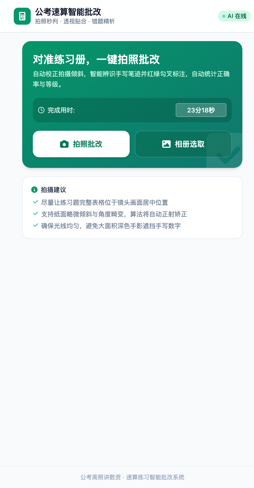
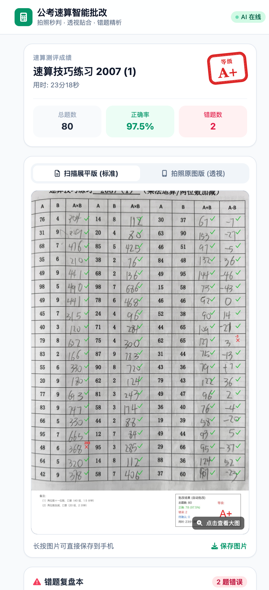
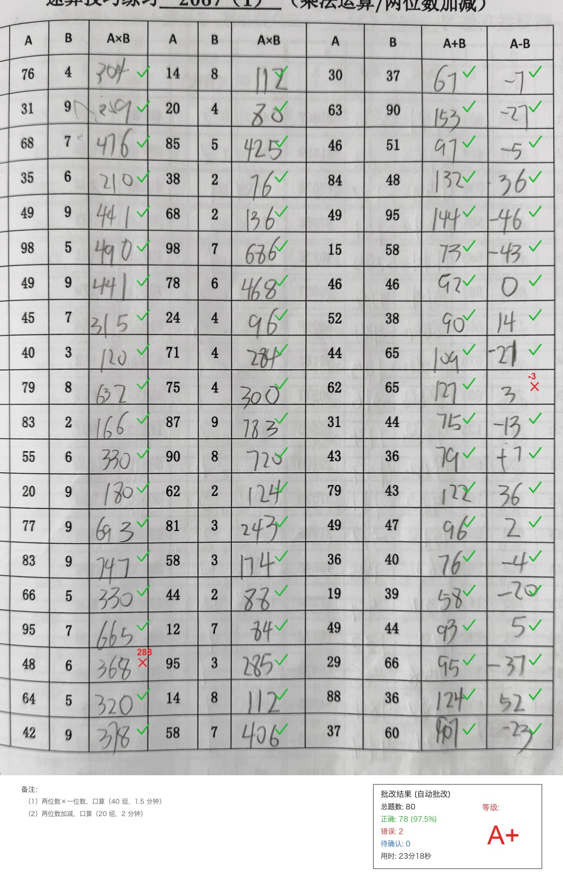
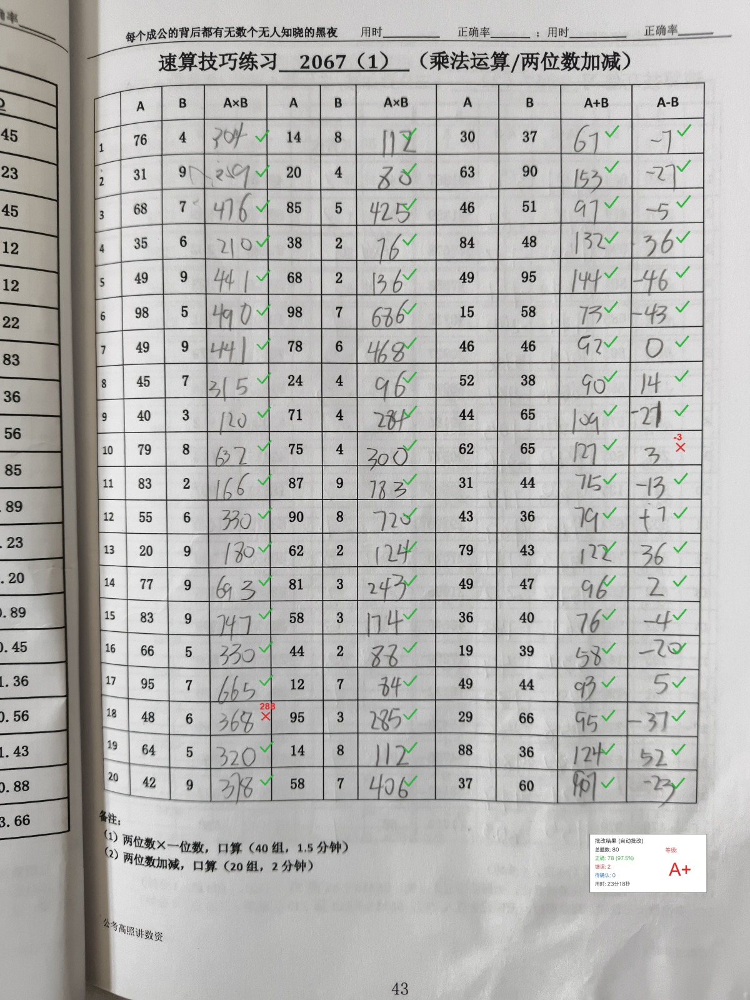
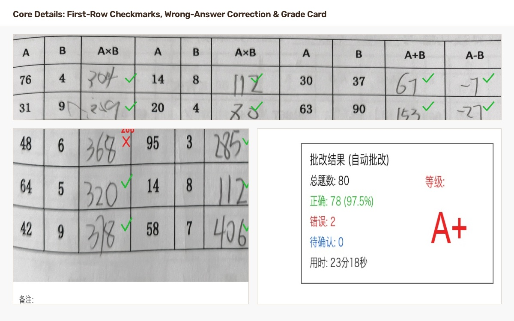

# 📐 公考数学速算练习册手机拍照智能批改系统 (Math Grader)

面向公务员考试《行测》资料分析速算练习册的**全自动智能批改系统**。支持手机扫码直接调起后置摄像头拍照，通过计算机视觉算法完成纸张透视矫正，结合多模态大模型提取手写笔迹，并通过 Python 严格算术规则自动核算判题，最终在展平图与原图上高保真标注绿色对勾、红色叉号、订正答案与统计卡片。

---

## 📸 页面与批改效果预览

### 1. 移动端 H5 界面（手机微信 / 浏览器直达）

| 📷 手机拍照上传主页 | 📊 智能批改结果与错题清单 |
| :---: | :---: |
|  |  |

### 2. 批改标注与高保真对齐效果

| 📄 扫描展平版标注全图 (Standard Scan) | 📱 手机拍摄原图逆透视贴合 (Perspective Overlay) |
| :---: | :---: |
|  |  |

### 3. 核心算法细节特写

> 包括**表头与第 1 行精准切分绿勾**、**错题红叉与红色标准答案标注**，以及**右下角 A+ 评级统计印章卡片**：

<p align="center">
  
</p>

---

## ✨ 核心特性

- 📱 **移动端极简体验与自带密钥 (BYOK)**：
  - **Bring Your Own Key (BYOK) 安全架构**：支持在手机端右上角【⚙️ 设置】配置个人 Base URL 与 API Key，数据**仅保存在手机本地浏览器 (`localStorage`)**，绝不在服务端持久化存储或记入日志，用完即弃；适合将服务部署在公网或局域网共享给多人使用，互不干扰；
  - 服务端启动后在终端自动生成局域网访问二维码；
  - 手机微信或自带浏览器扫码直达，直接调起原生后置高清摄像头拍照或相册选取；
  - 移动端支持无缝切换查看“标准展平图”与“拍照原图标注图”，并提供详细错题分析清单。

- 🔍 **稳健自适应的计算机视觉引擎 (`cv_detector.py`)**：
  - **对称平衡外扩**：四角点自适应扩展，确保表头与最底部题目全部完整容纳在正视画幅中；
  - **自相关物理行距测定 (Autocorrelation)**：提取中右侧无笔迹干扰区域的水平投影，通过一维自相关精准测量当前视角下的真实物理行距（96~104px），自适应适应不同拍摄距离；
  - **自底向上逆向锚定与波峰吸附**：以底部无干扰线为基准逆推 21 个物理行，并在 $\pm 12\text{px}$ 窗口内微调吸附，彻底解决顶部标题下划线干扰及第 1 行偶发漏批问题。

- 🤖 **多模态大模型视觉提取 (`vision_ocr.py`)**：
  - 一次性结构化提取整卷 20 行（60~80 道题）的题面数值（A, B）及学生手写笔迹；
  - 智能处理涂改痕迹、识别负号（如 `-365`）与未作答留白；
  - 自动识别多种题型：两位数乘法、三位数加减、多位数除以两位数（商首位）、多位数除以三位数（商前两位）。

- 🧮 **确定性数学判题与智能错因归因 (`math_judge.py`)**：
  - **杜绝大模型计算幻觉**：视觉模型仅负责笔迹提取，由 Python 本地执行严谨的确定性算术校验；
  - **深度学情画像与错因诊断**：自动识别并分类**漏写负号、减数颠倒、加法进位遗漏、减法退位借位失误、乘法尾数算错、乘法进位相加偏差、除法截位估大估小、数字位置颠倒**等多种典型考公计算失误；
  - **量身定制提分锦囊**：分析全卷做题节奏（如秒/题）、判定核心薄弱项，并给出针对行测资料分析计算特性的避坑点拨。

- 🎨 **双层高保真标注与图层渲染 (`renderer.py`)**：
  - **展平规范图**：在手写数字右侧精准绘制半透明绿色对勾 `✓`、红色叉号 `✗` 及红色标准订正答案；
  - **原始倾斜图**：通过逆透视单应性变换矩阵 $M^{-1}$ 将标注向量投射回原始倾斜手机照片；
  - **成绩统计卡片**：在表格空白区域生成包含等级印章、得分率、题数统计的专业批改卡片。

---

## 📂 项目结构

```text
math-correct/
├── cv_detector.py       # 计算机视觉：角点检测、透视变换与自适应网格分割
├── vision_ocr.py        # 多模态视觉模型提取题目与手写答案
├── math_judge.py        # 严格数学核算规则、对错判定与成绩统计
├── renderer.py          # 双层标注渲染（展平图/手机原图、勾叉与统计卡片）
├── main.py              # 批改流水线核心及 CLI 命令行入口
├── server.py            # FastAPI 移动端 Web 服务与局域网二维码展示
├── static/
│   └── index.html       # 极简移动端 H5 界面（原生相机调用、缩放预览）
├── output/              # 批改结果输出目录（自动生成）
├── requirements.txt     # Python 依赖清单
└── README.md            # 项目使用说明
```

---

## 🚀 快速上手

### 1. 环境准备

推荐使用 Python 3.10+：

```bash
# 安装依赖
pip install -r requirements.txt
```

### 2. 配置 API Key（两种方式）

系统支持兼容 Anthropic 协议的多模态视觉 API（如 Claude 3.5 Sonnet、Gemini Flash 等）：

- **方式 A：手机/前端自带 Key (BYOK，推荐部署共享)**：
  - 服务端无需配置任何 Key，直接启动；
  - 使用者在手机页面右上角点击 **【⚙️ 设置】**，填入个人 API Key 与中转地址；
  - **安全保障**：所有配置仅保存在客户端本地 `localStorage`，请求批改时随请求在内存中临时使用，绝不写入服务器磁盘或日志。

- **方式 B：服务端全局配置（适合个人独享）**：
  - 复制项目根目录模板：`cp .env.example .env`
  - 在 `.env` 中填入你的 `ANTHROPIC_BASE_URL` 与 `ANTHROPIC_AUTH_TOKEN`；
  - 或直接设置系统环境变量：
    ```bash
    export ANTHROPIC_BASE_URL="https://api.anthropic.com"
    export ANTHROPIC_AUTH_TOKEN="your-api-key"
    ```

### 3. 运行移动端服务（推荐）

```bash
python server.py
```

控制台将打印局域网访问链接与 ASCII 二维码：
- 确保手机与电脑处于**同一 Wi-Fi / 局域网**；
- 手机扫码后直接点击“拍照批改”调起后置摄像头，拍下练习卷即可在数秒内获得全卷智能批改反馈！

### 4. 命令行独立批改单张试卷

```bash
python main.py /path/to/sheet_photo.jpg --time-str "23分18秒"
```

批改完成后将在 `./output` 目录下生成：
- `*_annotated_scan.jpg`：扫描展平批改图；
- `*_annotated_original.jpg`：手机原图视角贴合标注图；
- `*_report.json`：详细答题明细与统计指标。

---

## 📄 License

MIT License
